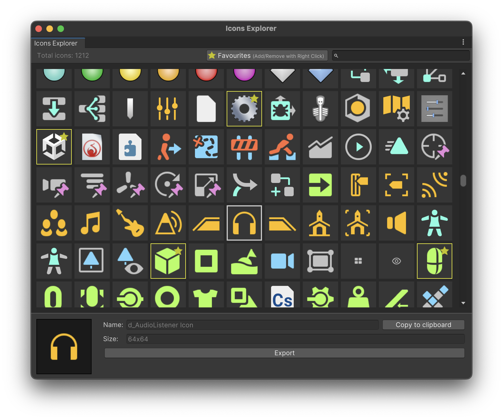

# 🔍 Unity Editor Internal Icons Explorer

[](https://unity3d.com/pt/get-unity/download/archive)
[](https://opensource.org/licenses/MIT)



---

## ✨ Features
- 🔍 **Explore** over 1200 internal Unity Editor icons
- ⭐ **Mark Favorites** with a right-click for quick access
- 🖼️ **Preview** and view icon metadata (name & size)
- 📋 Quick **Copy Name to Clipboard**
- 💾 **Export Icons** as PNG files
- ⚡ Built with **UI Toolkit** for performance and responsiveness

---

## ⚙️ Installation

1. Copy `EditorIconsExplorer.cs` into your Unity project's `Assets` folder:
   ```
   Your_Unity_Project/Assets/EditorIconsExplorer.cs
   ```
2. Open Unity. The tool will be accessible via:

	```
	Window → Editor Icons Explorer
	```

---

## 🧠 Usage

- 🖱️ **Left Click**: Preview icon, view its name and dimensions
- 🖱️ **Right Click**: Add/remove icon from the favorites list
- 🔎 **Search Bar**: Filter icons by name
- 📋 **Copy to Clipboard**: Copy the icon name and use it like:
  ```csharp
  EditorGUIUtility.IconContent("d_Favorite").image
  ```
- 💾 **Export**: Save the selected icon as a PNG file

---

## 📌 Example
- IMGUI
	```csharp
	GUIContent icon = EditorGUIUtility.IconContent("d_Favorite");
	GUILayout.Label(icon);
	```

- UIToolkit
	```csharp
	var favouritesButton = new Button();
	favouritesButton.style.backgroundImage = (Texture2D)EditorGUIUtility.IconContent("d_Favorite").image;
	```

---

## 🧰 Requirements

- Unity 2021.3 or newer because of UI Toolkit support

---

## 📜 License
This project is licensed under the terms of the [LICENSE](LICENSE) file.

